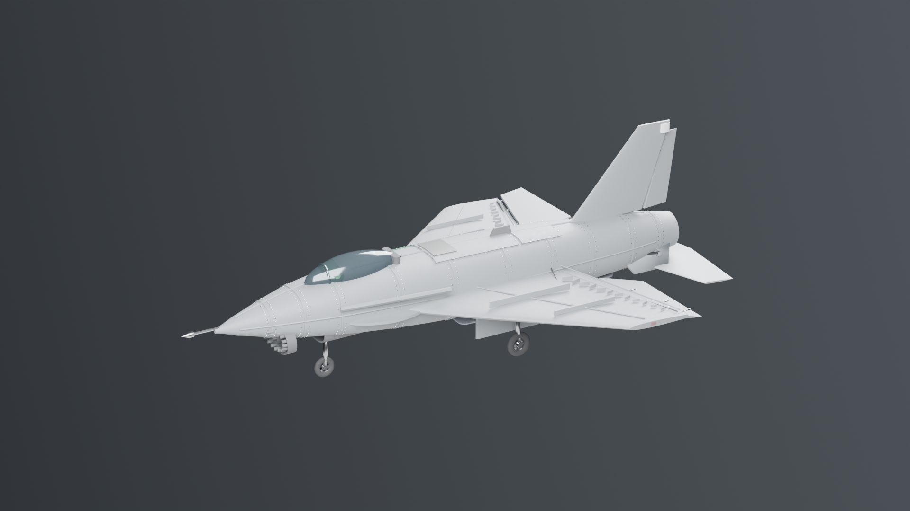
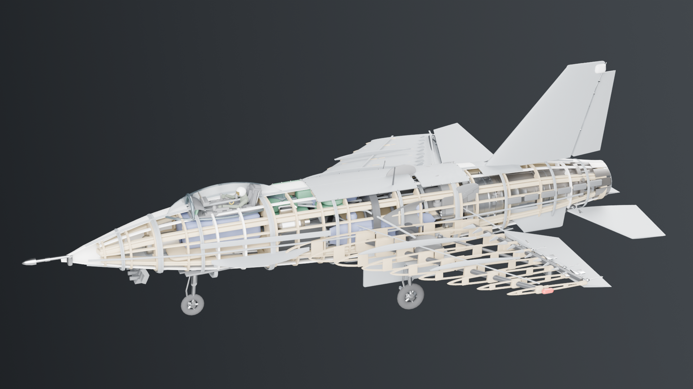

# RC jet — parametric 3D model

A complete RC jet airframe, generated procedurally in Blender from a single
specification file, built to fit inside **500 × 300 mm**. The engine is the
[F110-GE-129](https://github.com/krabduke/f110-turbofan) model from the sibling
project, scaled 1:33 and installed — not re-modelled.

**221 objects · 492 × 300 mm · 330 g all-up · 66 g/dm² · CG at 22.3 % MAC · 9.9 % static margin · builds in ~20 s**



## The design

Everything except the envelope and the engine was chosen here, and the
reasoning is in `plane/spec.py` next to the numbers.

| | |
|---|---|
| Configuration | Cropped-delta single-engine fighter |
| Length × span | 445 × 300 mm (limit 500 × 300) |
| Scale | 1:33 of a notional 15.05 m / 9.90 m fighter — set by the span limit |
| Wing | 185 mm root, 58 mm tip, 40° LE sweep, AR 2.47, 1.5° washout |
| MAC | 132.6 mm, leading edge at station 227 |
| All-up weight | 330 g |
| Wing loading | 90.5 g/dm² |
| Propulsion | F110-GE-129 at 1:33 — 140.3 mm long, 35.8 mm fan |
| Control | Flaperons, all-moving stabilators, rudder |
| Power | 3S 1300 mAh, 40 A ESC, 4 × 5 g servos |

**Why a delta.** At a 300 mm span a straight wing leaves too little area and
root chord to be stable, and nowhere to put a spar. A cropped delta keeps both,
and matches the engine we already had.

**Why the servos sit ahead of the firewall.** A 5 g servo is 22 mm deep and the
wing is 9 mm thick at the aileron, so they cannot live in the wing — and the
engine fills the whole tail. All four go in the bay between the spar bulkhead
and the firewall, on long pushrods. That is a real consequence of the
packaging, and it is why the pushrods are modelled.

**Why the spar is swept.** A straight spanwise spar at 30 % of the root chord
leaves a 40°-swept planform by y = 66 mm and the rest hangs in free air. The
first version did exactly that. Following a constant chord fraction out to the
tip keeps it buried in the section the whole way.

## Build

Requires Blender (`brew install --cask blender`). Nothing else.

```
make build      # generate geometry, assemble build/rcjet.blend, write parts.csv
make verify     # 32 dimensional and design checks   <- the definition of done
make render     # hero, plan, cutaway and exploded views
make export     # build/rcjet.glb  (Draco, 3.4 MB)
make stl        # one STL per part, in millimetres
```

## Layout

```
plane/
  spec.py       every dimension, mass and material. No geometry module holds a
                literal dimension; if a number describes the aircraft, it is here
  mesh.py       pure-Python primitives (shared with the engine project)
  airfoil.py    NACA sections (shared with the engine project)
  parts/
    common.py   the lifting-surface loft used by the wing and both tails
    fuselage.py superellipse loft, shelled skin, ply bulkheads
    wing.py     cropped delta, flaperons, LERX strakes, swept carbon spar
    tail.py     all-moving stabilators, fin with rudder, canted ventrals
    intake.py   chin inlet and the S-duct up to the engine face
    canopy.py   bubble canopy, windscreen bow, sill rails
    gear.py     tricycle gear, struts and wheels
    internals.py LiPo, ESC, receiver, servos, wiring, pushrods
    structure.py built-up frame: formers, longerons, stringers, wing and fin
                ribs, rear spar, piano hinges
    skin.py     panel seams, rivet rows, panel fasteners, doubler plates
    detail.py   control horns, pitot, aerials, fences, vortex generators,
                nav lights, gear doors, wheel hubs, pylons and missiles,
                static wicks, tailpipe shroud, cockpit interior
    engine_mount.py imports the F110 generators and scales them
  materials.py  PBR: EPO foam, control surfaces, tinted canopy, ply, carbon
  assemble.py   the Blender stage
  verify.py     measures the result and checks it against the design rules
  render.py     lighting, cameras, the skin-only cutaway
  export.py     GLB / per-part STL
f110/           the engine generators, vendored from the sibling project
```

`plane/` up to and including `parts/` is pure Python with no `bpy` import, so
the geometry can be generated and tested without Blender.

## Reusing the engine

`plane/parts/engine_mount.py` imports the engine's own generator modules,
coarsens their tessellation first (at 140 mm long, 2044 individually lofted
airfoils are finer than anything visible and would dominate the poly count),
builds them at full size in their own millimetres, then scales by 1:33 and
translates so the inlet flange lands on the firewall at station 300.

Nothing about the engine is re-modelled, and `verify.py` checks that the
installed length is still 4630 × 1/33 and that it clears the fuselage
internals at every station it occupies — the tightest point is 0.9 mm.



## Verification

`make verify` runs 32 checks. Dimensions are measured out of
`build/parts.csv`, so the envelope and fit checks test what actually got built.
The rest are design rules:

- plan envelope inside 500 × 300 mm
- engine installed length, station, and clearance inside the fuselage
- CG at 25 % MAC ± 3 %, computed from the real mass table
- main gear 6–22 % MAC aft of the CG, nose gear ahead of it, nose leg carrying
  6–18 % of AUW — the first version had the mains *ahead* of the CG, which
  would have sat the aircraft back on its tail
- horizontal and vertical tail volume coefficients in usable bands
- aspect and taper ratio
- spar stays inside the wing planform, and the rear spar sits ahead of the
  flaperon hinge it backs
- internal structure stays inside the skin it supports — ribs, formers,
  longerons and stringers all measured against the span
- skin relief is relief: seam standoff less than the skin thickness, rivet
  heads smaller than their seam
- completeness and material assignment

## Aerodynamic simulation

```
make validate    # check the solver against lifting-line theory first
make aero        # solve the aircraft and report its stability
```

A **vortex-lattice solve** of the wing, stabilators and fin — a real
three-dimensional potential-flow solve, not a coefficient lookup. The solver is
validated against lifting-line theory before it is trusted: lift slope within
7.5 % across AR 4–12, span efficiency 0.99 for a rectangular AR 8 wing, and
ground effect reproduced correctly.

| | |
|---|---|
| Lift slope | 2.83 per rad (0.049 per degree) |
| Trim α at 22 m/s | 6.3° |
| Neutral point | 32.2 % MAC |
| Centre of gravity | 22.3 % MAC |
| **Static margin** | **9.9 % MAC — stable, comfortable** |

The solve changed the aircraft. The first stabilator position sat in the wing's
wake sheet and too far forward; the solver put the neutral point barely ahead
of the CG. Moving it aft to 392 mm and 22 mm below the wake line is what bought
the margin — the tail is where it is because of this, not because it looked
right.

Span efficiency is reported but not trusted: the Trefftz routine is only
reliable above about AR 8 and this is a delta at AR 2.5, so it is a diagnostic
and nothing depends on it. The solve is inviscid throughout — no boundary
layer, no separation, no stall, no profile drag.

## Honesty

The airframe is an original design, not a scale model of a real aircraft — the
proportions are fighter-like because the engine is a fighter engine. The engine
itself carries the same caveat as its own project: the published envelope
figures are real, and everything internal is derived to be self-consistent with
them rather than being manufacturer data.

This is a **3D model with a credible mass and balance budget**, not a validated
flight article. The stability numbers come from a validated vortex-lattice solve, but
everything viscous is outside it: there is no CFD, no structural sizing, and
the 90 g/dm² wing loading
means it would be fast and want a firm launch. Build it and fly it at your own
risk.

## License

MIT — see [LICENSE](LICENSE).
